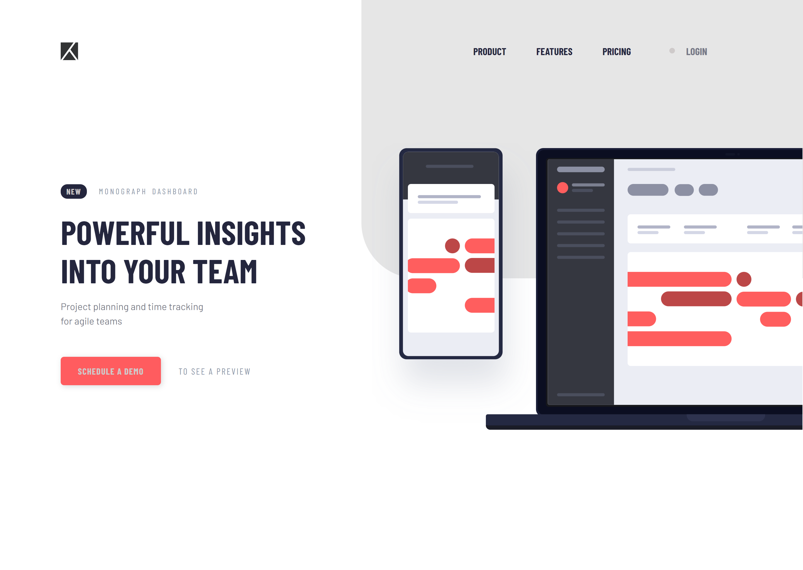

# 👩‍💻 Project tracking intro component 

## The challenge

Users should be able to:

- View the optimal layout for the site depending on their device's screen size
- See hover states for all interactive elements on the page

## Built with

- React
- Styled-components
- Mobile-first workflow

  <h3>
    <a href= "https://react-project-tracking-intro.netlify.app/">
      Live site
    </a>
     | 
    <a href= "https://www.frontendmentor.io/challenges/project-tracking-intro-component-5d289097500fcb331a67d80e">
      Challenge
    </a>
  </h3>

This application/site was created as a submission to <a href= "https://www.frontendmentor.io/">Frontend Mentor Challenges</a> 
