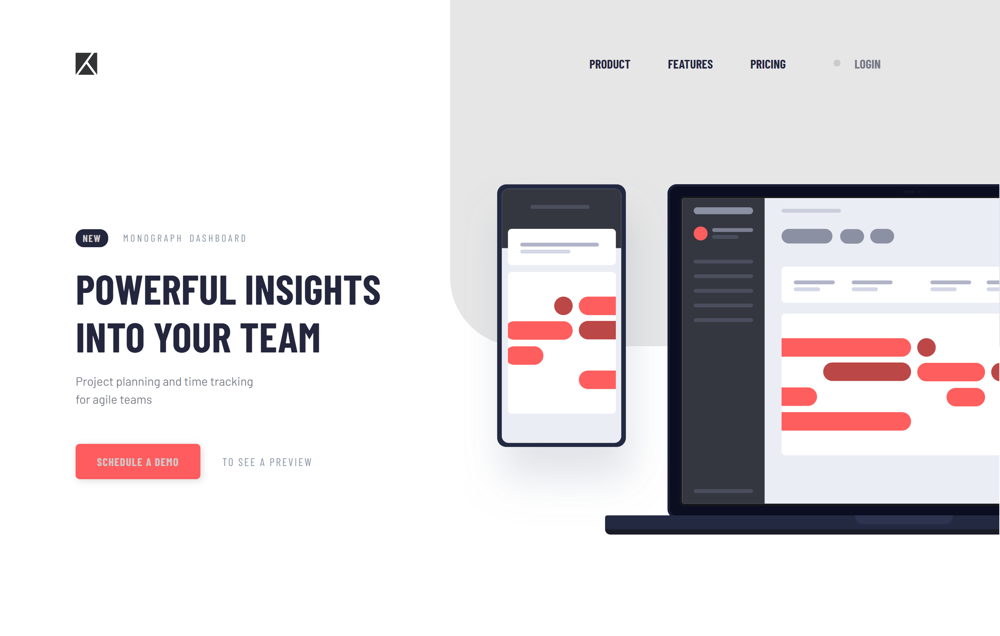

# 👩‍💻 Frontend Mentor - Project tracking intro component solution

Frontend Mentor challenges help you improve your coding skills by building realistic projects. 

This is a solution for [Project tracking intro component](https://www.frontendmentor.io/challenges/project-tracking-intro-component-5d289097500fcb331a67d80e) challenge.

## The challenge

Users should be able to:

- View the optimal layout for the site depending on their device's screen size
- See hover states for all interactive elements on the page

## Built with

- React
- Styled-components
- Mobile-first workflow

## Live site solution

[Live site](https://react-project-tracking-intro.netlify.app/) hosted on Netlify.

## Author

- Frontend Mentor - [@amansgz](https://www.frontendmentor.io/profile/amansgz)

Join to [Frontend Mentor Discord community](https://discord.gg/UAfh3qzhYb)